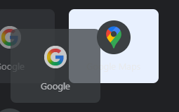

# Unlimited Shortcuts

A Chrome extension that removes the 10-shortcut limit and provides unlimited shortcuts with iOS/Android-style folder organization.



## Features

- ✅ **Unlimited shortcuts** - No more 10-shortcut limitation
- ✅ **Folder organization** - iOS/Android-style folders to group shortcuts
- ✅ **Drag and drop** - Intuitive drag-and-drop to create folders and reorganize
- ✅ **Auto favicon fetching** - Automatically fetches and displays website favicons
- ✅ **Dark mode support** - Toggle between light and dark themes
- ✅ **Search functionality** - Quickly find shortcuts by name or URL
- ✅ **Multi-language support** - English and Japanese localization
- ✅ **Import/Export** - Backup and restore your shortcuts

## Installation

### From Source (Development)

1. Clone this repository:
   ```bash
   git clone https://github.com/ibushimaru/Unlimited-shortcut.git
   cd Unlimited-shortcut
   ```

2. Open Chrome and navigate to `chrome://extensions/`

3. Enable "Developer mode" in the top right corner

4. Click "Load unpacked" and select the cloned directory

5. The extension will be installed and set as your default new tab page

### From Chrome Web Store
(Coming soon)

## Usage

### Adding Shortcuts

1. Click the "+" button to add a new shortcut
2. Enter the website name and URL
3. Click "Save"

### Creating Folders

1. Drag one shortcut onto another to create a folder
2. The folder will automatically be created with both shortcuts inside
3. Click on the folder to open and view shortcuts

### Organizing Shortcuts

- **Drag and drop** shortcuts to reorder them
- **Drop on folder** to add a shortcut to an existing folder
- **Drag out of folder** (in folder modal) to remove from folder
- **Right-click** or use the kebab menu (⋮) to edit or delete

### Search

- Use the search bar at the bottom to filter shortcuts by name or URL
- Search works across all shortcuts including those in folders

### Dark Mode

- Click the sun/moon icon in the top right to toggle dark mode

## Development

### Project Structure

```
Unlimited-Shortcuts/
├── manifest.json          # Extension manifest (Manifest V3)
├── newtab.html           # New tab page HTML
├── css/
│   └── styles.css        # Styles including dark mode
├── js/
│   ├── shortcuts.js      # Main shortcut management logic
│   ├── newtab.js         # New tab page interactions
│   ├── favicon.js        # Favicon fetching service
│   ├── modal-drag-fix.js # Modal drag-out functionality
│   └── mouse-drag.js     # Alternative mouse-based drag implementation
├── images/               # Extension icons
└── _locales/            # Internationalization files
    ├── en/              # English translations
    └── ja/              # Japanese translations
```

### Key Technologies

- Chrome Extension Manifest V3
- Chrome Storage Sync API
- HTML5 Drag and Drop API (with mouse event fallback)
- CSS Grid Layout
- Vanilla JavaScript (no frameworks)

### Building and Testing

1. Make changes to the source files
2. Go to `chrome://extensions/`
3. Click the refresh button on the extension card
4. Open a new tab to test changes

### Debugging

Open DevTools (F12) in a new tab and use these commands:

```javascript
// Check current shortcuts
debugFolders()

// Test drag and drop
simpleDragTest()

// Force HTML5 drag
forceHTML5Drag()
```

## Contributing

1. Fork the repository
2. Create your feature branch (`git checkout -b feature/amazing-feature`)
3. Commit your changes (`git commit -m 'Add some amazing feature'`)
4. Push to the branch (`git push origin feature/amazing-feature`)
5. Open a Pull Request

## Known Issues

- HTML5 drag and drop may not work in some environments (mouse drag fallback available)
- Maximum storage is limited by Chrome Sync Storage quota (102,400 bytes)

## License

This project is licensed under the MIT License - see the [LICENSE](LICENSE) file for details.

## Acknowledgments

- Inspired by Chrome's default New Tab page
- Icons and design influenced by Material Design guidelines